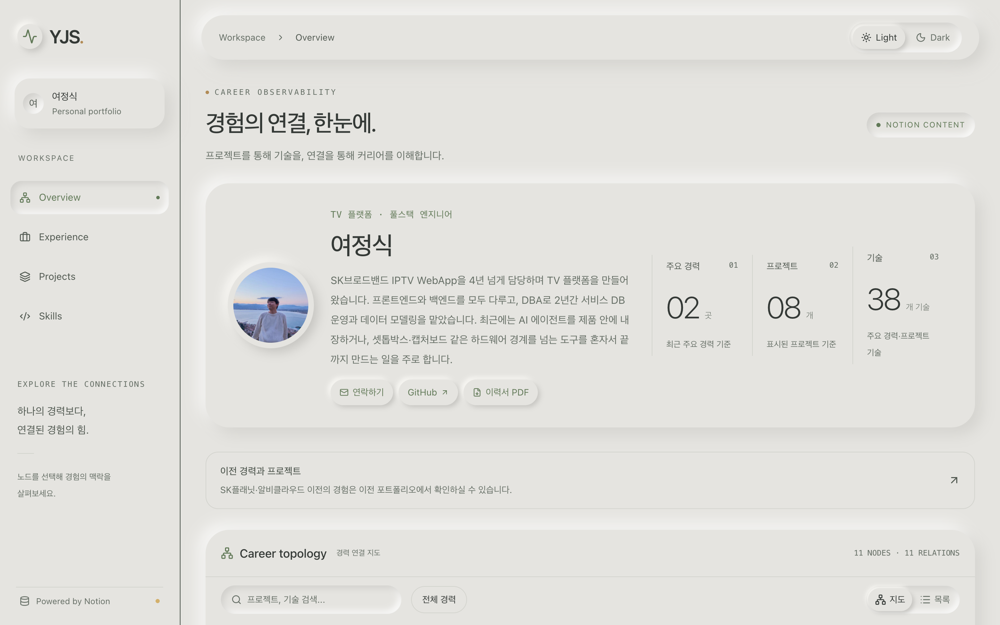
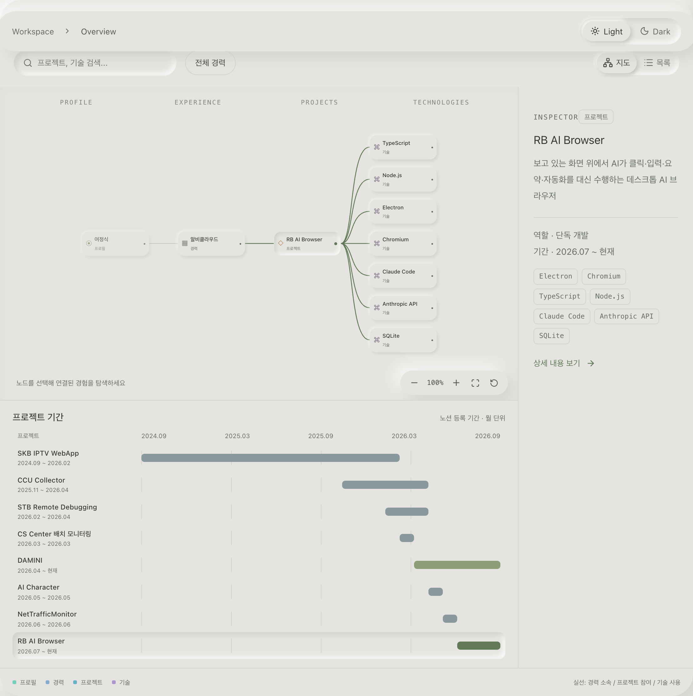
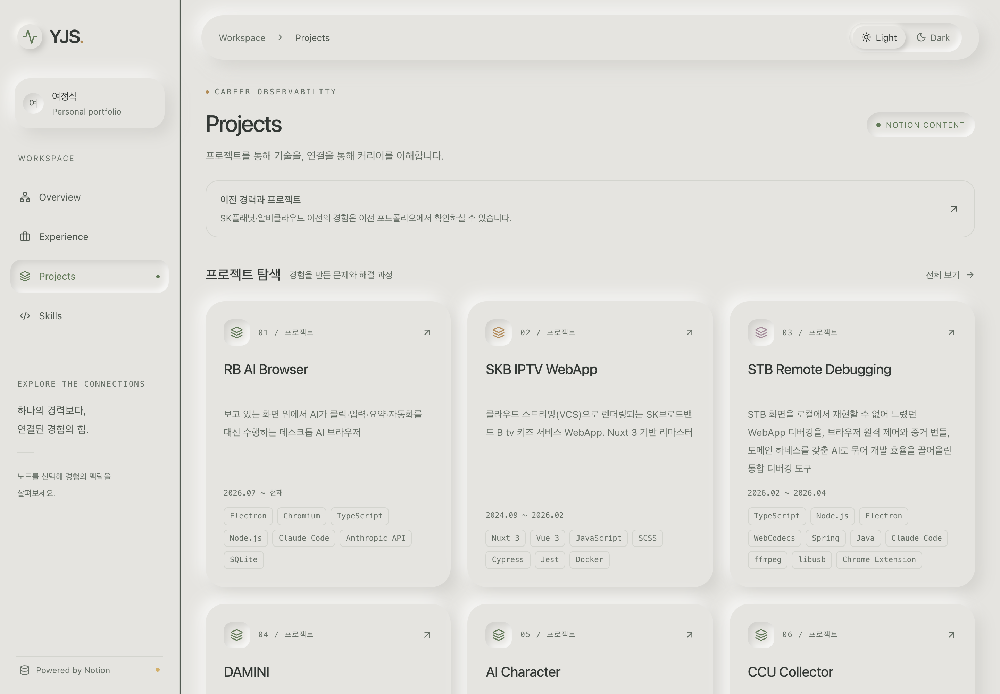
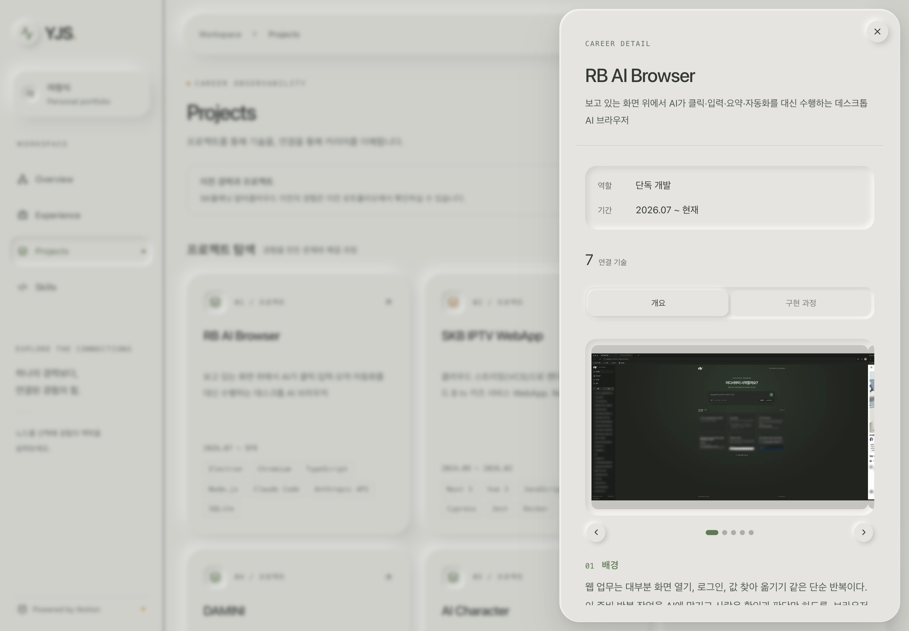
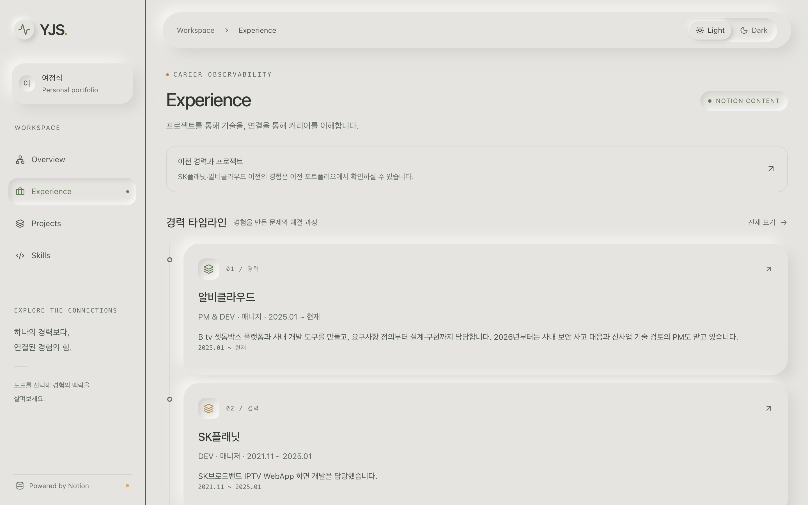
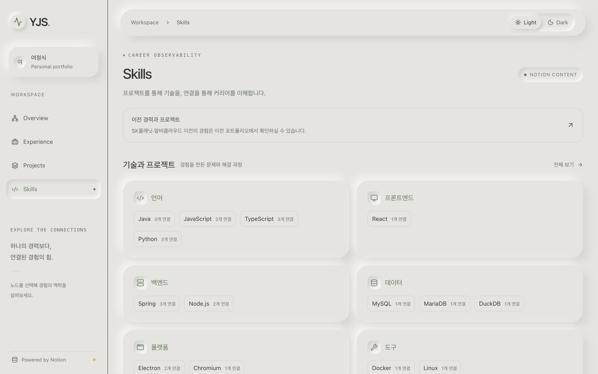
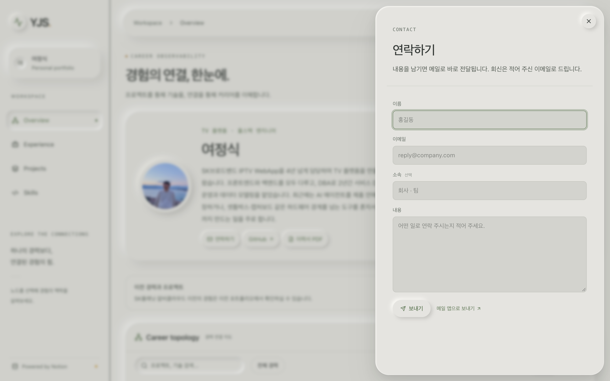
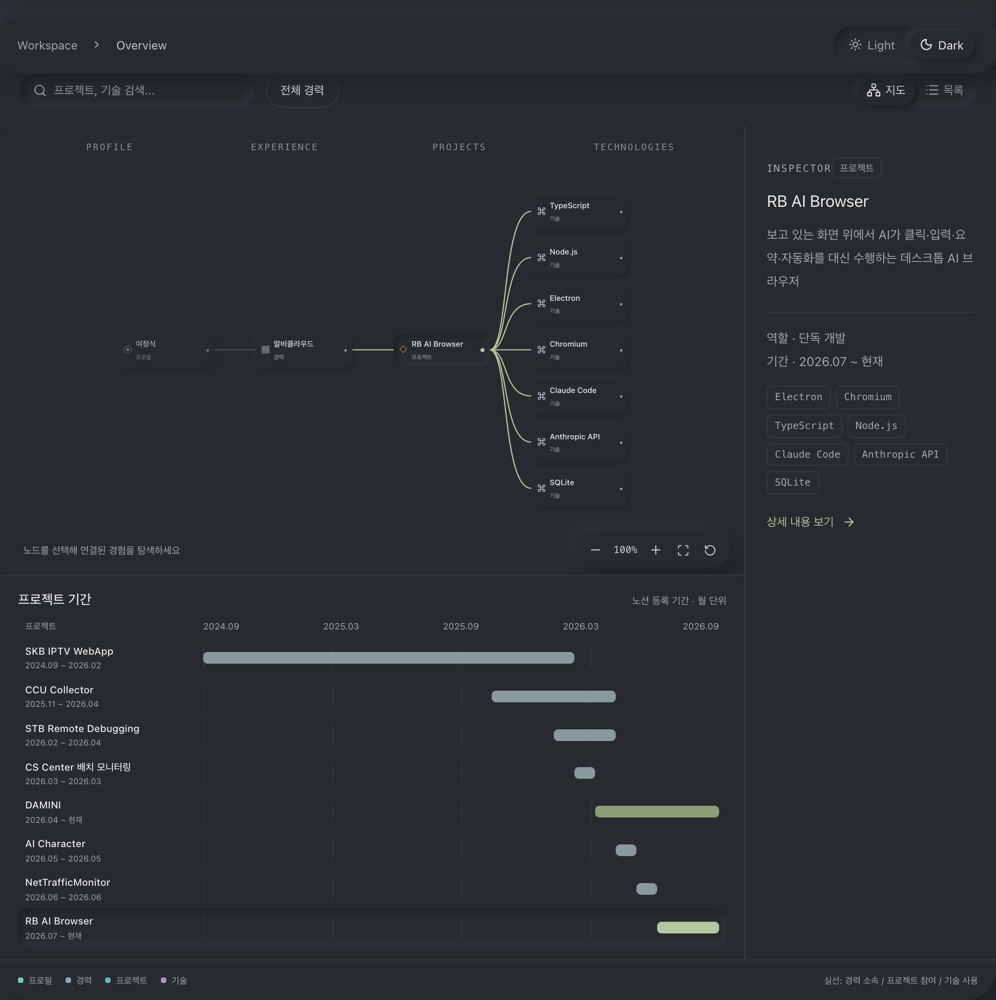
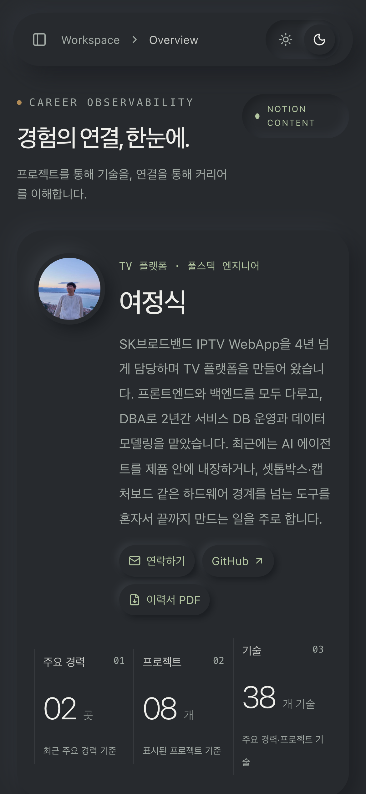

# Vantage · Career Observatory

> 경력 → 프로젝트 → 실제 사용 기술의 연결을 한눈에 탐색하는 APM 콘셉트 포트폴리오.
> Notion을 유일한 콘텐츠 소스로 쓰고, Cloudflare Workers + D1 + R2 위에서 동작합니다.

**Live:** https://portfolio.yeojs.dev



## 무엇을 보여주는가

일반적인 이력서는 회사와 프로젝트를 나열합니다. 이 사이트는 Datadog Service Map이나 JENNIFER 토폴로지 차트처럼 **프로필 → 경력 → 프로젝트 → 기술**을 4열 그래프로 배치하고, 노드를 고르면 연결된 관계만 강조합니다. "이 기술을 어디서 실제로 썼는가"가 곧바로 보입니다.

- 콘텐츠는 전부 Notion 데이터베이스 5개(Profile / Experience / Project / Skill / Credential)에서 옵니다. 코드에 하드코딩된 경력이 없습니다.
- 숫자 지표(경력 수, 프로젝트 수, 기술 수)는 현재 데이터를 세어서만 표시합니다. 연차나 성과를 추론해 만들지 않습니다.
- 기술 표기는 원문 그대로 둡니다. `Vue3`, `Vue 3`, `Vue.js`를 임의로 합치지 않습니다.

## 화면

### Career topology

노드 선택, 관련 관계 강조, 검색, 경력 범위 필터, 확대/축소/이동, 초기화를 제공합니다. 오른쪽 Inspector에 선택한 노드의 요약과 스택이 뜨고, 아래 간트 차트는 Notion에 등록된 프로젝트 기간을 월 단위로 그립니다.



### 프로젝트 카드와 상세 시트

프로젝트는 카드 그리드로도 훑을 수 있습니다. 상세 시트는 Notion 본문을 `개요` / `구현 과정` 탭으로 나누고, Project DB의 `screenshots` 파일 속성에 올린 이미지·영상을 슬라이드쇼와 라이트박스로 보여줍니다.

| 프로젝트 목록 | 프로젝트 상세 |
|---|---|
|  |  |

### 경력 타임라인과 기술 그룹

| Experience | Skills |
|---|---|
|  |  |

### 연락하기와 이력서 PDF

- **연락하기**: 사이트 안의 시트에서 메시지를 보냅니다. D1에 먼저 저장한 뒤 Cloudflare Email Routing으로 릴레이하며, 릴레이가 실패해도 메시지는 남습니다. IP 해시 기준 시간당 5건, 전체 하루 40건으로 제한하고 허니팟 필드로 봇을 거릅니다.
- **이력서 PDF**: 사이트가 렌더링하는 같은 Notion 데이터를 A4 문서로 투영합니다. 브라우저에서 `pdf-lib`로 생성하므로 서버 왕복이 없고, 한글은 Pretendard 서브셋 폰트를 임베드합니다.



### 다크 테마와 모바일

Light / Dark 두 테마를 지원하고, 선택은 브라우저에 기억됩니다. 모바일에서는 토폴로지 대신 목록으로 같은 내용을 탐색합니다. `prefers-reduced-motion`, 비활성 탭, 화면 밖 애니메이션 정지를 지원합니다.

| Dark | Mobile |
|---|---|
|  |  |

## 기술 스택

| 영역 | 사용 |
|---|---|
| UI | React 19, TypeScript, Tailwind CSS 4, shadcn/ui, lucide-react, next-themes |
| 프레임워크 | Next.js 앱 구조를 Vite 위에서 돌리는 vinext (`@vitejs/plugin-rsc`) |
| 런타임 | Cloudflare Workers (`nodejs_compat`), `@cloudflare/vite-plugin` |
| 데이터 | Notion 공식 API → D1 (Drizzle ORM) 스냅샷 캐시, R2 스크린샷 미러 |
| 메일 | Cloudflare Email Routing `send_email` 바인딩 (Resend 키가 있으면 대체 경로) |
| PDF | pdf-lib + fontkit, Pretendard 서브셋 |

## 동작 방식

```
Notion API ──(동기화, 최대 5분마다)──▶ D1 content_cache ──▶ /api/portfolio ──▶ 브라우저
                │                                                         │
                └─ page_bodies (last_edited_time 기준 본문 캐시)             └─ 60초 폴링
Notion 파일 URL ──(첫 요청 시 미러)──▶ R2 BUCKET ──▶ /api/screenshots/[key]
연락 폼 ──▶ /api/contact ──▶ D1 contact_messages ──▶ Email Routing
```

- 브라우저는 보이는 동안 60초마다 `/api/portfolio`를 조회하고, 서버는 D1의 마지막 성공 스냅샷을 5분간 재사용합니다. 만료 후 첫 요청이 Notion을 재조회하므로 열린 화면 기준 보통 5~6분 안에 반영됩니다. 방문이 없으면 동기화하지 않습니다.
- 각 갱신은 전체 스냅샷 교체입니다. 추가·수정·삭제가 모두 반영되고, 일시 오류 시에는 마지막 정상 콘텐츠를 유지합니다. 권한 철회나 인증 오류는 오래된 콘텐츠를 숨깁니다.
- `page_bodies` 테이블은 페이지 본문을 `last_edited_time`과 함께 보관해, 바뀌지 않은 페이지는 블록 API를 다시 부르지 않습니다. 동기화당 Notion 호출이 약 47회에서 11회로 줄어 Workers 서브리퀘스트 한도 안에 들어옵니다.
- Notion 파일 URL은 1시간 뒤 만료됩니다. 스크린샷은 첫 요청 때 R2로 복사하고 이후에는 불변 캐시 헤더로 R2에서 서빙합니다.
- `429`, `529`, 일시적 서버 오류에는 지수 백오프와 `Retry-After`를 적용하고, D1 임대 잠금으로 동시 갱신을 막습니다.

## Notion 데이터 구조

`NOTION_ROOT_ID` 아래 직접 하위인 5개 DB만 읽습니다. 그 밖의 하위 페이지나 DB는 조회하지 않습니다.

| DB | 속성 |
|---|---|
| Profile | name, headline, summary, email, github, linkedin, blog |
| Experience | company, role, period, summary, stack, order, domain, featured(선택) |
| Project | title, oneLiner, role, period, stack, experience(Relation, 복수 가능), featured, order, repoUrls, demoUrl, docsUrl, achievements, screenshots(Files, 선택) |
| Skill | name, category, order |
| Credential | title, issuer, date |

- Experience에 `featured` 체크박스를 두면 체크된 회사와 소속 프로젝트만 표시하고, 나머지는 「이전 경력과 프로젝트」 링크로 안내합니다. 속성이 없으면 전부 표시합니다.
- 행에 `Published` 체크박스를 추가하면 false인 행을 제외합니다.
- 프로젝트 본문의 `배경`, `판단`, `규모`, `성과` 제목은 개요 탭의 독립 문단이 되고, 작업 로그는 구현 과정 탭으로 갑니다.
- 어댑터는 `lib/notion-workspace.ts`에 있습니다. 5개 DB 환경 변수 없이 일반 페이지나 단일 DB를 루트로 쓰는 fallback 규칙은 `lib/notion-client.ts`와 `lib/notion-parser.ts`에 있습니다.

## 로컬 실행

Node 22.13 이상이 필요합니다.

```sh
npm ci
cp .env.example .env      # NOTION_TOKEN 등 채우기
npm run db:migrate:local  # 로컬 D1 초기화
npm run dev
```

로컬 주소는 실행 로그에 표시됩니다(기본 `http://localhost:5173`). 개발 서버는 `wrangler.jsonc`의 바인딩을 읽고 `.env` 값을 주입합니다. 로컬에서는 연락 폼 메시지가 D1에만 저장되고 메일은 발송되지 않습니다.

```sh
npm test            # 모의 Notion API 기반 코어 테스트
npx tsc --noEmit
npm run build
```

### 환경 변수

| 변수 | 용도 |
|---|---|
| `NOTION_TOKEN` | 읽기 권한만 가진 Internal Integration 토큰 |
| `NOTION_ROOT_ID` | 공개할 루트 페이지 ID |
| `NOTION_PUBLISH_ENABLED` | 루트 콘텐츠의 사이트 노출을 허용하면 `true` |
| `NOTION_DB_PROFILE` … `NOTION_DB_CREDENTIAL` | 위 5개 DB의 ID 허용 목록 |
| `CONTACT_SALT` | 연락 폼 IP 해시용 솔트(선택) |
| `RESEND_API_KEY`, `CONTACT_TO`, `CONTACT_FROM` | Email Routing 대신 Resend를 쓸 때만(선택) |

토큰은 서버 전용입니다. `NEXT_PUBLIC_` 접두사를 붙이거나 브라우저에 노출하지 마세요.

## 배포 (Cloudflare Workers)

Worker 이름, D1, R2, Email Routing 바인딩과 커스텀 도메인은 `wrangler.jsonc`에 있습니다. `@cloudflare/vite-plugin`이 빌드 시 이를 `dist/server/wrangler.json`으로 변환합니다.

```sh
npx wrangler login                                  # 최초 1회
npx wrangler secret bulk .env --name portfolio-yjs  # 비밀 값이 바뀔 때
npm run db:migrate:remote                           # 스키마 변경이 있을 때만
npm run deploy                                      # 빌드 후 Worker + 정적 자산 배포
```

`routes[].custom_domain: true` 덕분에 `portfolio.yeojs.dev`의 DNS 레코드와 인증서는 배포 시 자동으로 생성됩니다. 연락 폼의 `send_email` 목적지 주소는 Cloudflare Email Routing에서 미리 인증돼 있어야 합니다.

## 구조

```
app/
  observatory.tsx          화면과 탐색 상태 (토폴로지, 카드, 상세 시트, 갤러리)
  theme-controls.tsx       Light/Dark 전환과 view transition
  api/portfolio/           D1 스냅샷 반환, 만료 시 Notion 재동기화
  api/screenshots/[key]/   Notion 파일 → R2 미러와 서빙
  api/contact/             연락 폼 저장과 메일 릴레이
components/
  contact-form.tsx         연락 시트
  resume-button.tsx        이력서 PDF 다운로드 버튼
lib/
  notion-client.ts         인증된 공식 API, 재시도, 페이지네이션, 접근 범위
  notion-workspace.ts      5개 DB → 도메인 모델 어댑터
  notion-parser.ts         일반 페이지/단일 DB fallback 어댑터
  sync.ts                  캐시 재검증과 실패 정책 (독립 테스트 가능)
  notion.ts                D1 저장소와 어댑터 연결
  resume.ts / resume-pdf.ts  이력서 투영 모델과 pdf-lib 렌더러
  contact.ts               연락 폼 검증과 메일 본문
db/schema.ts, drizzle/     content_cache, page_bodies, contact_messages 스키마와 마이그레이션
tests/core.test.ts         모의 API 테스트
docs/readme/               이 문서의 스크린샷
```

## 테스트 범위

- 중첩 블록과 페이지네이션, 접근 범위 제한, 안전하지 않은 URL 제거
- 요청 제한 재시도와 `Retry-After`, 캐시 만료와 삭제 반영, 마지막 정상 데이터 유지, 권한 철회
- 바뀌지 않은 페이지의 본문 캐시 재사용
- 이력서 투영(연차, 5단 경력 블록, 대표 프로젝트, 표)과 줄바꿈 규칙
- 연락 폼 검증(공백 제거, 길이 제한, 이메일 형식, 허니팟)

## 디자인

`DESIGN-VERSIONS.md`에 세 버전의 디자인 이력이 Git 태그로 보존돼 있습니다. 현재는 v3 **Soft neumorphism**입니다. 따뜻한 회색 표면 위에 올라오고 눌리는 컨트롤, 절제된 세이지·오커 강조색을 씁니다. 특정 브랜드의 로고나 화면을 복제하지 않았습니다.

## 참고한 자료

- [Datadog Service Map](https://docs.datadoghq.com/tracing/services/services_map/): 관계 중심 탐색과 상세 선택 패턴
- [JENNIFER TopologyChart](https://frontend-design.jennifersoft.com/j5-components/topology-chart): 레이어와 관계 표현
- [Notion 인증](https://developers.notion.com/guides/get-started/authorization), [블록 조회](https://developers.notion.com/reference/get-block-children), [요청 제한](https://developers.notion.com/reference/request-limits)
